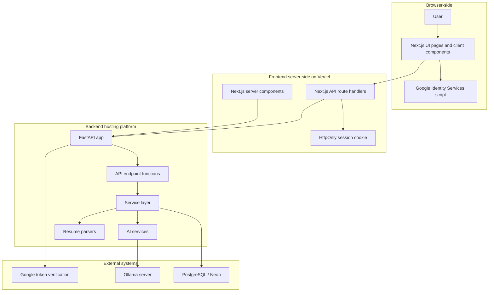
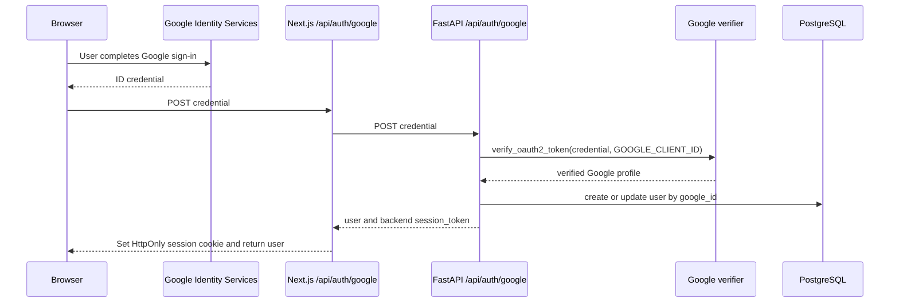
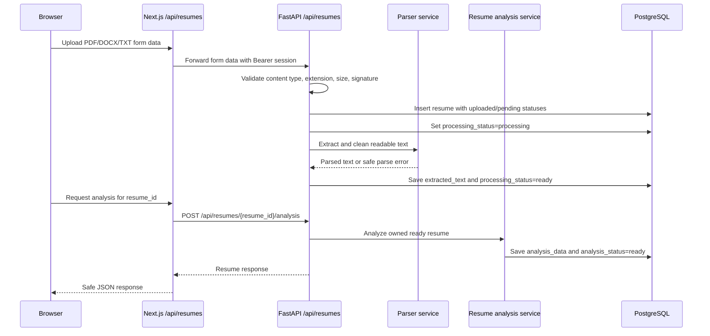
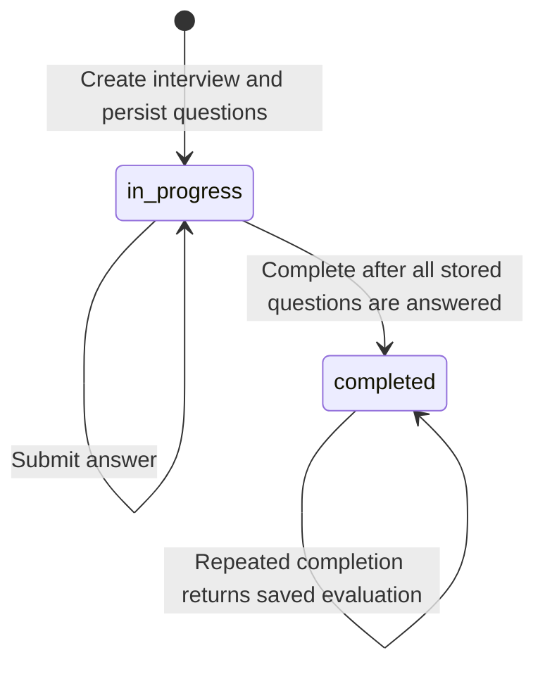
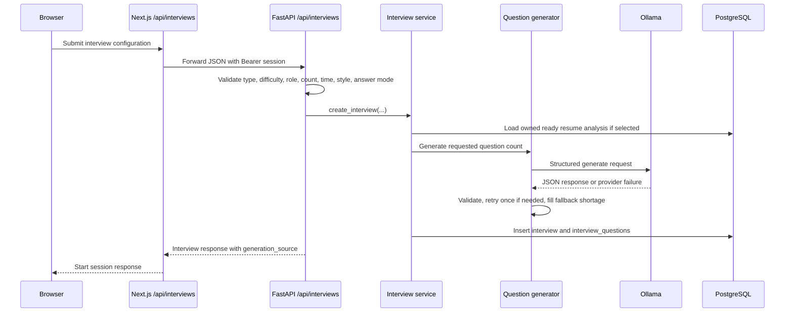
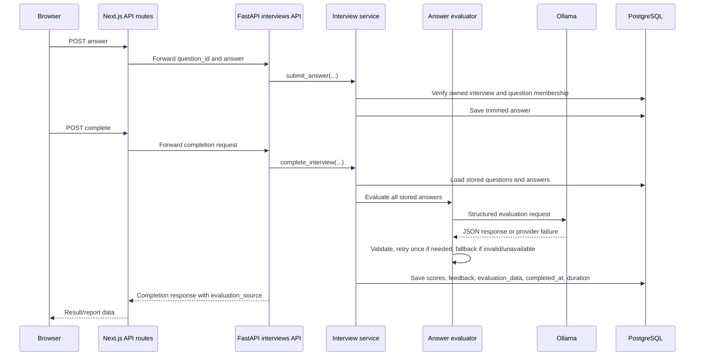

# HireMind Architecture

This document describes the HireMind 1.0 architecture as implemented in the
repository. It focuses on system boundaries, data flow, service responsibilities,
authentication, AI integration, and trade-offs.

## System Overview

HireMind is split into a Next.js frontend and a FastAPI backend.

- The browser renders the product UI and interacts with Next.js pages and route
  handlers.
- Next.js API route handlers act as a server-side proxy to the FastAPI backend.
- FastAPI owns authentication validation, authorization, business logic,
  database writes, resume parsing, AI calls, analytics, and reports.
- PostgreSQL stores users, profiles, resumes, interviews, answers, and
  evaluation/report data.
- Ollama is the local AI provider used by backend services for question
  generation and answer evaluation.

## High-Level Diagram

## Main Components

| Component | Location | Responsibility |
| --- | --- | --- |
| Next.js App Router | `frontend/src/app` | Pages, route layouts, metadata, loading/error boundaries, API proxy routes |
| Shared frontend components | `frontend/src/components` | Sidebar, forms, reports, upload UI, charts, settings, UI primitives |
| Frontend API helpers | `frontend/src/lib/api.ts` | Typed server-side API calls used by pages and components |
| Auth helpers | `frontend/src/lib/auth.ts` | Reads the HttpOnly session cookie on the Next.js server |
| FastAPI app | `backend/app/main.py` | App creation, middleware, explicit endpoint registration |
| Backend routers | `backend/app/api` | Thin request/response endpoint functions and Pydantic models |
| Service layer | `backend/app/services` | Business logic, ownership checks, analytics, reports, profile handling |
| AI services | `backend/app/ai` | Ollama client, prompt construction, generation/evaluation validation and fallback |
| Models | `backend/app/models` | SQLAlchemy table mappings |
| Migrations | `backend/alembic/versions` | Alembic schema history |

## Frontend Architecture

The frontend uses the Next.js App Router. Pages are organized under
`frontend/src/app`, with route-level `loading.tsx` and `error.tsx` boundaries for
major application areas.

Important frontend characteristics:

- Server components load protected data by reading the session cookie with
  `getSessionToken()`.
- Client components are used for interactive forms, interview sessions,
  settings tabs, upload flows, theme controls, and report actions.
- Next.js route handlers under `frontend/src/app/api` proxy browser requests to
  FastAPI.
- `frontend/src/lib/routeErrors.ts` centralizes safe JSON parsing and proxy
  response forwarding.
- `frontend/src/lib/serverConfig.ts` centralizes `BACKEND_API_URL` and fails in
  production if it is missing.
- `frontend/next.config.ts` configures security headers including CSP,
  `nosniff`, frame protection, referrer policy, permissions policy, and HSTS in
  production.
- Metadata, robots, sitemap, manifest, favicon, and Open Graph assets are
  implemented in the Next.js app.
- The theme system sets `data-theme` and the `dark` class on the root document
  before hydration where practical.

### Why Next.js API Proxy Routes Exist

The browser does not call FastAPI directly for authenticated application
requests. Instead:

1. The browser calls a same-origin Next.js API route.
2. The Next.js route reads the HttpOnly session cookie server-side.
3. The route forwards the request to FastAPI with an `Authorization: Bearer`
   header.
4. The route returns a safe response to the browser.

This keeps the session token out of browser JavaScript and gives the frontend a
single same-origin API surface.

## Backend Architecture

`backend/app/main.py` creates the FastAPI application, configures trusted hosts
and CORS, then registers endpoint functions explicitly with `app.add_api_route`.

Backend responsibilities are separated as follows:

- `app/api`: request models, response models, dependency wiring, and endpoint
  functions.
- `app/services`: business rules, ownership checks, persistence orchestration,
  analytics, reporting, profile normalization, resume analysis.
- `app/ai`: Ollama HTTP integration, prompt construction, structured response
  parsing, validation, retry, and deterministic fallback decisions.
- `app/parsers`: PDF and DOCX extraction helpers.
- `app/models`: SQLAlchemy ORM mappings.
- `app/database.py`: SQLAlchemy engine, session factory, and `get_db`
  dependency.
- `app/config.py`: Pydantic settings, environment aliases, normalization, and
  production validation.

The backend uses SQLAlchemy ORM sessions with `pool_pre_ping=True`. Each request
receives a session from `get_db()`, and service functions commit changes where
needed.

## Authentication and Session Architecture

FastAPI verifies Google ID tokens with the configured `GOOGLE_CLIENT_ID`.
Google ID tokens are not used as long-term HireMind sessions. Instead, the
backend issues a signed JWT session token containing the HireMind `users.id` as
`sub`, with `iat` and `exp`.

The Next.js auth route stores that backend session token in an HttpOnly cookie:

- cookie name defaults to `hiremind_session`
- `SameSite=Lax`
- `Path=/`
- `Secure` in production
- `Max-Age` currently set by the frontend route

Authenticated FastAPI endpoints use `get_current_user`, which reads the Bearer
token forwarded by Next.js, verifies the JWT, and loads the user from the
database.

Logout is implemented in the Next.js API layer by clearing the session cookie.

## Authorization Model

The backend scopes user-owned resources by `current_user.id`.

| Resource | Ownership behavior |
| --- | --- |
| Profile | `GET/PATCH /api/profile` always uses the authenticated user; no user ID is accepted |
| Resumes | Resume list filters by `Resume.user_id`; analysis and interview context lookup require matching `user_id` |
| Interviews | Detail, answer, completion, report, and history queries filter by `Interview.user_id` |
| Answers | A submitted `question_id` must belong to the loaded owned interview |
| Reports | Report lookup filters by interview ID and authenticated user ID |
| Analytics | Aggregations include only interviews where `Interview.user_id == current_user.id` |

Most cross-user access attempts are returned as `404` for resource lookups. Some
invalid state transitions return `400` or `409` depending on the failure.

## Database Architecture

The database is PostgreSQL, with Neon-compatible connection strings documented
for production. Alembic migrations are the source of schema history. The ORM
models map five application tables:

- `users`
- `user_profiles`
- `resumes`
- `interviews`
- `interview_questions`

See [database.md](database.md) for the full entity and JSONB field
documentation.

## AI Provider Architecture

Ollama integration is isolated in `backend/app/ai/ollama_client.py` and uses
direct HTTP calls:

- `GET /api/tags` for health/model availability.
- `POST /api/generate` with `stream: false`.
- `format: "json"` for structured question and evaluation flows.
- Bounded request timeout from `OLLAMA_TIMEOUT_SECONDS`.
- Configured model from `OLLAMA_MODEL`.

Question generation and evaluation use strict Pydantic validation and
deterministic fallbacks. The frontend never sends arbitrary prompts to the AI
provider.

## Resume Processing Flow

Supported upload content types:

- `application/pdf`
- `application/vnd.openxmlformats-officedocument.wordprocessingml.document`
- `text/plain`

Maximum upload size is 5 MB. PDF files must begin with `%PDF`; DOCX files must
begin with `PK`. The parser rejects files with no readable text. OCR is not
implemented.

## Interview Lifecycle

Current stored interview statuses are:

- `in_progress`
- `completed`

`question_count`, `time_limit_minutes`, `evaluation_style`, and `answer_mode`
are stored on the interview. Actual stored questions are treated as the source
of truth for completion and evaluation.

### Interview Creation Flow

### Answer Submission and Completion Flow

## Reporting and Analytics

Reports are built from existing stored interview data. There is no separate
report table. `interview_report_service.py` normalizes:

- interview metadata
- overall score and performance label
- stored `evaluation_data`
- per-question answer, score, feedback, strength, and improvement
- transparent metrics such as completion rate and average question score
- deterministic recommendations based on improvements and low-scoring question
  topics

Analytics are computed by `interview_analytics_service.py` from the
authenticated user's interviews:

- total interviews
- completed interviews
- in-progress interviews
- average completed score for valid 0-100 completed scores
- highest score
- latest completed score
- most-practised target role with deterministic tie-breaking
- latest 10 scored completed interviews oldest-to-newest for trend data
- average score grouped by interview type

These analytics are preparation summaries, not scientific skill measurements.

## Error Handling Strategy

Frontend:

- Route-level `error.tsx` and `loading.tsx` files provide friendly boundaries.
- `readJsonSafely`, `responseErrorMessage`, and proxy helpers prevent malformed
  JSON from leaving the UI stuck.
- Proxy routes convert backend failures into safe messages and preserve status
  codes where practical.
- Skeletons and empty states are used for major pages.

Backend:

- Pydantic validates request bodies and query parameters.
- Authentication failures return `401`.
- Missing owned resources generally return `404`.
- Invalid state transitions return `400` or `409`.
- Upload parsing errors return safe user-facing messages.
- Ollama health/generation failures return safe `503` or `504` responses for AI
  status/test routes.
- Interview creation and completion use fallback paths so provider failure does
  not block core interview workflows.

## Security Controls

Security architecture is documented in more detail in [../SECURITY.md](../SECURITY.md).

Implemented controls include:

- backend Google token verification
- HttpOnly session cookie
- Bearer token validation on backend endpoints
- user ownership checks
- CORS allow-list and trusted host middleware
- frontend security headers and CSP
- bounded upload size and file signature checks
- Pydantic request validation
- AI output validation before persistence
- production settings validation for critical backend env values

Deployment-layer rate limiting is recommended and not implemented as a
distributed application feature.

## Deployment Architecture

Recommended topology:

- Vercel hosts the Next.js frontend.
- A Python web platform such as Render, Railway, or Fly.io hosts FastAPI.
- Neon hosts PostgreSQL.
- Google Identity Services handles sign-in credential generation.
- Ollama must run somewhere reachable by the backend.

Ollama usually cannot run inside a serverless frontend deployment. Practical
options are:

- run Ollama on the backend machine when the host supports it
- run Ollama on a separate private CPU/GPU VM
- replace Ollama later with a hosted provider behind the same backend service
  boundary

## Architectural Decisions and Trade-Offs

| Decision | Reason | Benefit | Trade-off |
| --- | --- | --- | --- |
| Next.js frontend plus FastAPI backend | Separate UI/product concerns from Python AI/data services | Clear ownership and good Python ecosystem access | Two deployable services and more env configuration |
| Next.js API proxy routes | Keep session cookie server-side and provide same-origin browser API | Token is not exposed to browser JavaScript | Adds forwarding code |
| Backend-issued session token | Google ID token is not used as the app session | App controls expiration and identity lookup | Requires secret management |
| PostgreSQL with Alembic | Structured relational data and migration history | Reliable persistence and ownership queries | Requires migration discipline |
| Local Ollama provider | Works without cloud AI API keys | Private/local AI path and predictable fallback | Requires infrastructure reachable by backend |
| Deterministic fallbacks | Preserve user workflows when AI is invalid/unavailable | Better resilience | Fallbacks are less personalized than AI |
| JSONB for analysis/evaluation details | Flexible structured outputs with backward compatibility | Easier iteration | Database does not enforce full JSON shape |
| Deployment-layer rate limiting | Avoid in-memory limits pretending to be distributed | Honest production posture | Requires platform/gateway configuration |

## Known Limitations

- No OCR; scanned image-only resumes are not parsed.
- No separate reports table; reports are normalized from interview data.
- JSONB fields rely on application validation.
- Ollama availability and output quality affect AI personalization.
- App-level distributed rate limiting is not implemented.
- AI output is preparation guidance and may be incorrect.

## Future Architecture Options

- Provider abstraction for hosted AI models.
- Background job queue for long-running parsing/evaluation.
- Dedicated object storage for uploaded files if persistent file retention is
  required.
- Browser-based integration tests for critical user journeys.
- Deployment-layer or distributed rate limiter.
- Dedicated audit/event log if compliance requirements grow.
